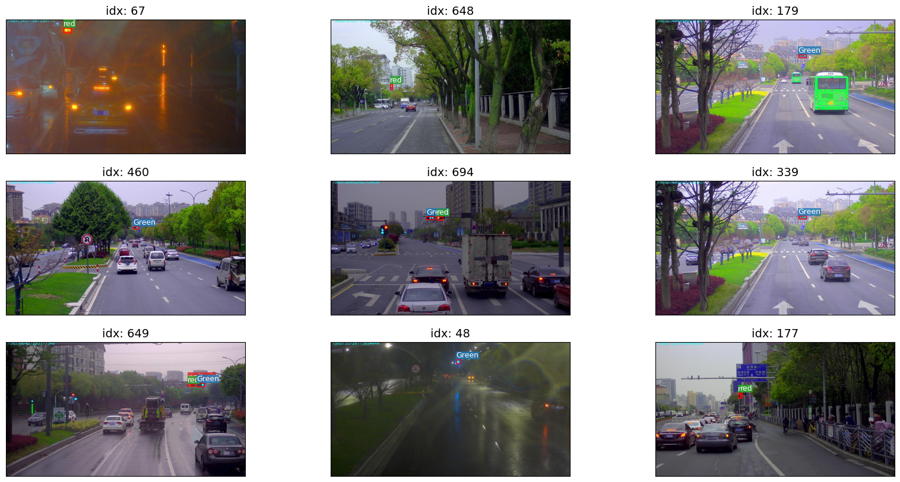
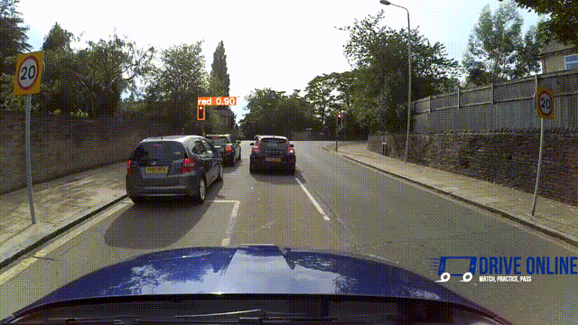

# Traffic Lights Detection On Street Level Imagery

Fine-tuning the state-of-the-art RT-DETR object detection model for detecting small traffic lights in street-level high-resolution imagery. The project demonstrates effective training strategies for small object detection and a reliable inference pipeline using slicing techniques.

# Overview

Detecting small traffic lights in high-resolution street imagery is challenging due to the tiny scale of targets relative to the scene. This repository presents a complete pipeline for:

* Training RT-DETR on tiled images to improve detection of small traffic lights.

* Using SAHI (Slicing Aided Hyper Inference) during inference for robust video results.

* Delivering higher accuracy compared to naïve full-image training.

# Dataset

We use the [Small Traffic Light dataset](https://universe.roboflow.com/sovitopencvuniversity/small-traffic-light) from Roboflow Universe, consisting of ~1,222 annotated images focused on traffic lights in diverse real-world scenes.

# Object Detection Model: RT-DETR

RT-DETR (Real-Time Detection TRansformer) is a transformer-based object detector that directly predicts bounding boxes and class labels in an end-to-end fashion, eliminating heuristics like anchors and NMS. Its hybrid design enables real-time performance while using global context, which is beneficial for detecting small, sparsely distributed objects like traffic lights.

# Training Strategy

#### Full-Resolution Training (1920×1080)

Training RT-DETR directly on full-resolution images did not yield good performance for small traffic lights. Large backgrounds and scale imbalance make the model focus more on dominant regions than tiny targets.

#### Tiled Training (1024×1024)

We slice each image into overlapping 1024×1024 tiles with 10% overlap during training. This approach:

* Improves the object-to-background ratio.

* Preserves boundary objects via overlap.

* Provides richer supervision for small objects.

As a result, the model achieves significantly better detection performance compared to full-image training.

#### Lower-Resolution Training (512×512, 640×640)

Experiments on smaller training resolutions like 512×512 or 640×640 produced mAP@50–95 scores ≤ 42, likely due to downsampling-related loss of detail, making it hard for the model to learn small features effectively.

# Inference Pipeline with SAHI

To match the training setup at test time and improve detection consistency:

* We apply SAHI (Slicing Aided Hyper Inference).

* Each frame is sliced into overlapping 1024×1024 regions.

* RT-DETR is run on each slice independently.

* Predictions are merged into original image coordinates

This significantly improves recall and stability on traffic videos and ensures the model detects small signals more reliably.

🔸 Example Results: You can find inference visualizations in the inference_result/ folder.

# Results

* Better mAP performance through tiled training.

* Stable detection on high-resolution video using SAHI.

* Handles small, context-dependent objects more effectively than naïve approaches.

###### Here are the performance metrics on the validation set:

*   `mAP50:` 90.3%
*   `mAP50-95:` 53.7%
*   `Precision:` 90.6%
*   `Recall:` 91.1%

# Summary

This repository presented a comprehensive small traffic light detection pipeline by adapting RT-DETR for high-resolution street imagery. Tiled training at 1024×1024 with 10% overlap and SAHI-based inference work together to overcome the inherent challenges of small object detection in large images. This approach delivers reliable detection performance suitable for intelligent transportation and real-world perception systems.

